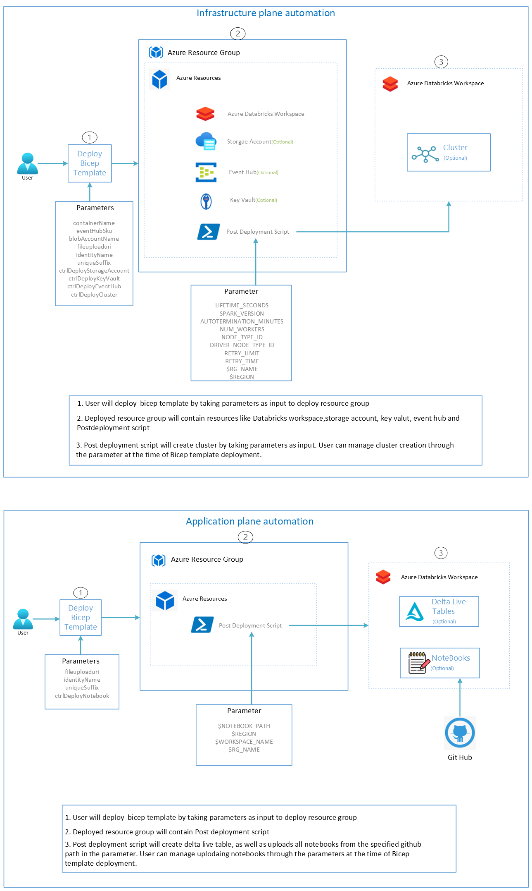

# Azure Databricks

This 1-click deployment allows the user to deploy environment of Azure Databricks with cluster, pipeline and notebook and other necessary infrastructure resources.

## SDLC Flow


## Infrastructure and Application Plane Flow



## Prerequisites For Deployment

To deploy, you need **owner role** as we are assigning RBAC roles and write access on the resources you're deploying and access to all operations on the Microsoft.Resources/deployments resource type.

## Network Access
 
Network Access configuration is enabled using below mentioned approach based on the Azure Resource Manager parameter value **Endpoint Type**.
- **Public** - Here, all the deployed resources are accessed publically including databricks workspace, cluster, ADLS gen 2 etc. No private link configuration. 
- **Private** – All the resources (ADLS storage gen2, key vault, event hub) along with databricks (Both front-end and back-end) will be on private link. Downside to this approach will be as Front-end connectivity(databricks workspace, API etc) is locked down to require private link, we cannot use Azure Resource Manager deployment script to carry out post deployment activities like cluster deployment, importing artifacts etc. All these activities should be carried out by running post deployment script in Azure CLI/Powershell on virtual machine/bastion in vnet environment.
- **Hybrid** – (Default approach choosen) , **Recommended when infrastructure automation is in place**. Here databricks would have public access along with private link configuration, since Front-end (databricks workspace, API etc) will be accessed publicly so automation of post deployment script execution is achieved, and back-end can only be accessed privately. Rest of the other resources (ADLS storage gen2, key vault, event hub) will also be accessed privately.

## Deployment Steps

1. Click **'Deploy To Azure'** button given below to deploy all the resources.

[](https://portal.azure.com/#create/Microsoft.Template/uri/https%3A%2F%2Fraw.githubusercontent.com%2FDatabricksFactory%2Fdatabricks-migration%2Fdev%2Fmain.json)

Provide the values for the following parameters or default values will be considered:
- Resource group (create new) 
- Region (Default value is 'east us') 
- Option (PublicMode/PrivateMode/HybridMode) for Endpoint Type (Default value is 'HybridMode') - Here ```PublicMode``` is public endpoint deployment, ```PrivateMode``` is private endpoint deployment and ```HybridMode``` is private endpoint hybrid deployment. Please select the endpoint according to your requirements. 
- Pricing Tier (Default value is 'Premium')
- Workspace Name (Default value is 'default')
- Option (true/false) for Event Hub deployment (Default value is true)
- Event Hub SKU (Default value is 'Standard')
- Event Hub Rule Name (Default value is 'rule')
- Blob storage account name (Default value is 'adls')
- Option (true/false) for Key Vault deployment (Default value is true)
- Utc Value (utcNow)
- Option (true/false) for Ctrl Deploy Pipeline  (Default value is true)
- Option (true/false) for Cluster deployment (Default value is true)
- Ctrl Syntax Type (Default value is 'DeltaLiveTable') - Select either DeltaLiveTable or DeltaTable syntax notebooks to be imported
- Ctrl Source Notebook (Default value is 'RawFileSource') - Select which source notebook to be imported from the syntax parameter you selected above.
- Lifetime Seconds(Databricks token) (Default value is 1200)
- Cluster name (Default value is 'dbcluster')
- Spark Version (Default value is '11.3.x-scala2.12')
- Auto Termination Minutes(cluster) (Default value is 30)
- Num Workers (Default value is 2)
- Node Type Id (Default value is 'Standard_DS3_v2')
- Driver Node Type Id (Default value is 'Standard_DS3_v2')
- Retry Limit (Default value is 15)
- Retry Time (Default value is 60)
- Pipeline Name (Default value is 'Sample Pipeline')
- Nsg Name (Default value is 'databricks-nsg')
- Private Subnet Cidr (Default value is '10.179.0.0/18')
- Private Subnet Name (Default value is 'private-subnet')
- Public Subnet Cidr (Default value is '10.179.64.0/18')
- Private Endpoint Subnet Cidr (Default value is '10.179.128.0/24')
- Public Subnet Name (Default value is 'public-subnet')
- Required Nsg Rules (Default value is 'NoAzureDatabricksRules')
- Vnet Cidr (Default value is '10.179.0.0/16')
- Vnet Name (Default value is 'databricks-vnet')
- Private Endpoint Subnet Name (Default value is 'default')

2. Click **'Review + Create'**.

3. On successful validation, click **'Create'**.

## Post Deployment

The **OneClickDeploy.ps1** is the post deployment script used to deploy a **Cluster**, import **notebooks**, create a **pipeline** and upload files to storage account in the Databricks Workspace.
- The script contains the code to create an all-purpose cluster in databricks workspace if you choose **Ctrl Deploy Cluster** parameter as **true**.
- The script will import the notebooks into workspace from **Artifacts** folder from the GitHub repo based on your input.
- And the script will also create a pipeline/workflow if you choose **Ctrl Deploy Pipeline** parameter as **true**.
- Script will also import Notebooks from **Artifacts/Example/** folder from Git repo to workspace.
- Also the files from **data** folder from git repo will be uploaded to data container in storage account.

If you choose **false** for the above parameters or if you choose for Private mode deployment, you have to run the script manually in Azure CLI/Powershell by passing the required parameters explicitly or create them using Databricks workspace Interface. 

## Azure Key Vaults: Assign Access Policies to Owner using PowerShell

Please run the [azure-key-vaults-assign-access-policies.ps1](https://raw.githubusercontent.com/DatabricksFactory/databricks-migration/dev/azure-key-vaults-assign-access-policies.ps1) script in Azure CLI by updating with key vault name and user email id. The script will assign all the **Key permissions** and ```Set```, ```Get```, ```List```, ```Delete``` **Secret permissions** to the user.

## Connect to Azure Data Lake Storage Gen2 or Blob Storage using Azure credentials

**OAuth 2.0 with an Azure service principal**: Databricks recommends using Azure service principals to connect to Azure storage. To create an Azure service principal and provide it access to Azure storage accounts please refer **Steps** folder document.

## Azure Services being deployed

1. Databricks Workspace
2. Eventhub
3. ADLS Gen 2 Storage account with a Container **data** and csv files uploaded in it.
4. Key Vault
5. Network Interface
6. Network security group
7. Private DNS zone
8. Private endpoint
9. Virtual network
10. Databricks workspace will have a Cluster, Notebooks and a Pipeline.
