## Access storage with Azure Active Directory

Registering an application with Azure Active Directory (Azure AD) creates a service principal you can use to provide access to Azure storage accounts. You can then configure access to these service principals using credentials stored with secrets.

Databricks recommends using Azure Active Directory service principals scoped to clusters or SQL warehouses to configure data access.

### Register an Azure Active Directory application

1.	Go to **Azure Active Directory** and click on **App Registrations** under **Manage** on the left pane.
3.	Now click on **"+ New Registration"** to create a new **App Registration**.

    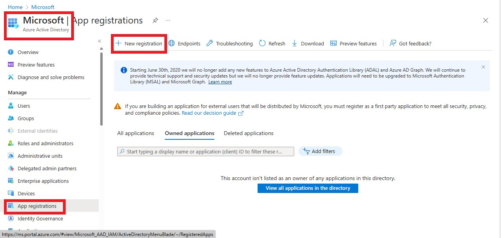

5.	Give the name as ``app_registration_dblab`` and click on **Register**.

    

7.	Once created, copy the **Client ID** and **Directory ID** from the overview page to a notepad for future reference.

    

9.	Now click on **Certificates and secrets** under the **Manage** in the left pane.
11.	Create a new **Client Secret** by naming it ``client_secret_dblab`` and click on **Add**.
15.	Once done, copy the **Client Secret Value** for future reference.

    
    
    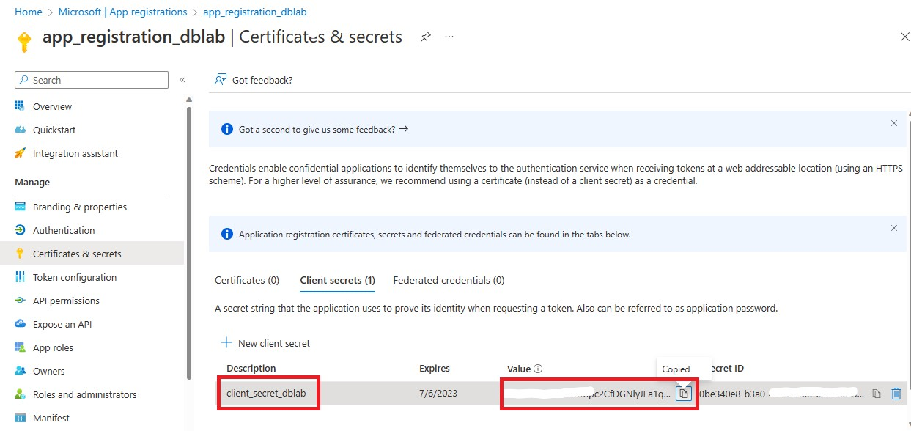
    
17.	  Go to your storage account.  
      **adls-{Random-String}** --> **Access Control** in the left pane -- > **Add role assignment**  
      
      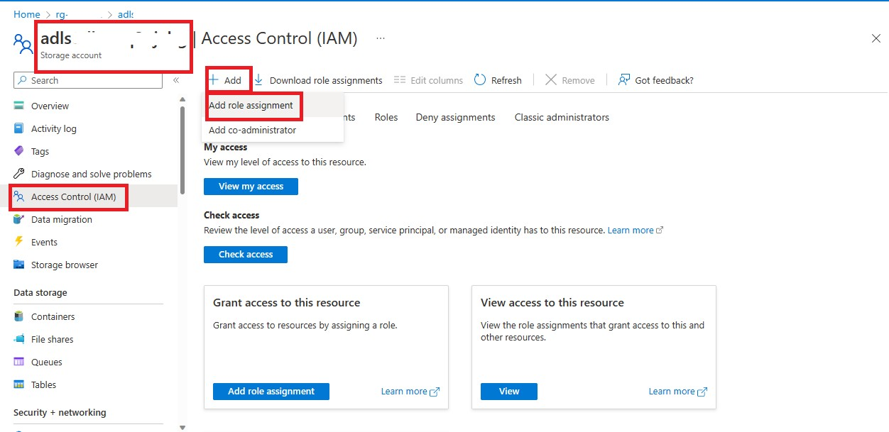
      
18. Search for **Storage Blob Data Contributor** --> Next --> Select **Members** --> Search for **app_registration_dblab** --> Select --> Review and Assign.
    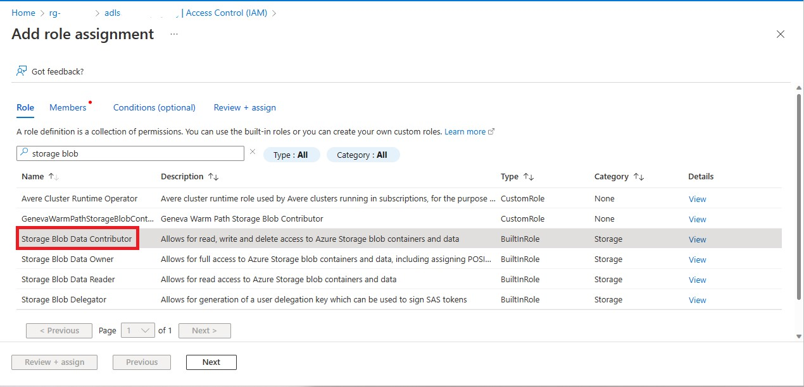
      
    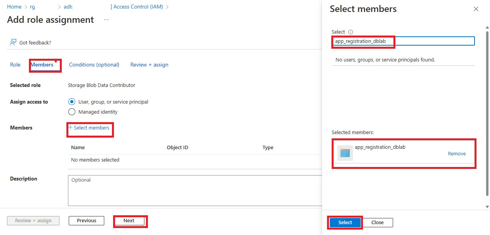
    
    
    
19.	Go to your Key Vault which goes by the name **keyvault{utcNow}** present in your resource group and click on **Access Policies** in the left pane. **Create** a new access policy for the app_registration_dblab.
    
    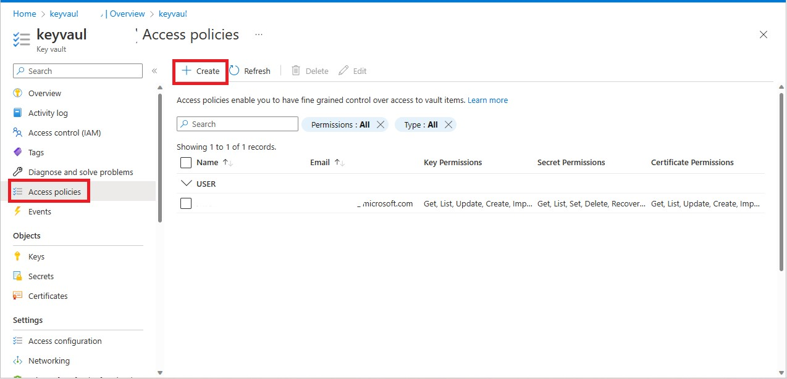
    
22. Select **Get** and **List** under *Key permissions* and *Secret permissions*.
    
    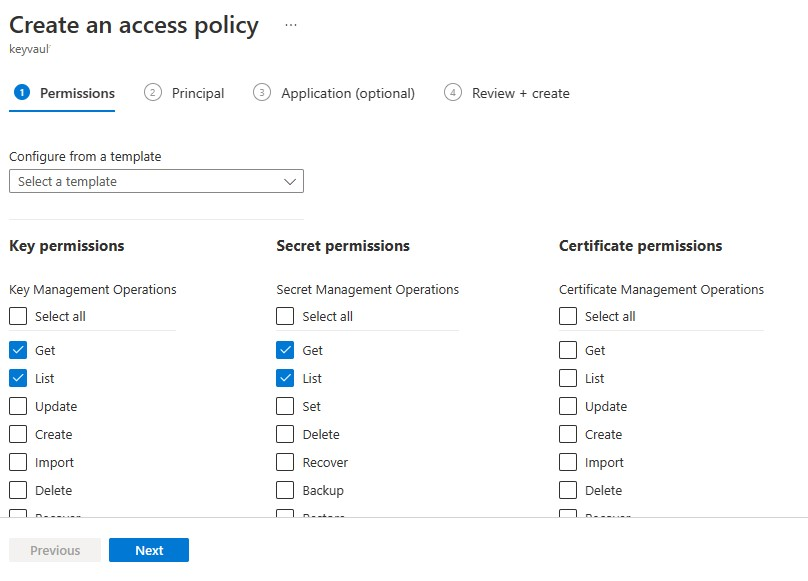
    
21. Select **app_registration_dblab** in *Principal* tab.
    
    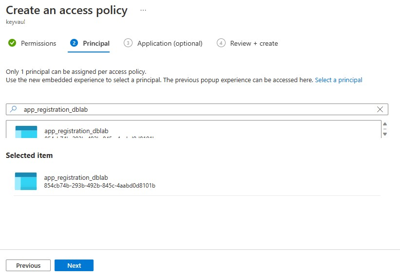
    
23. Review and create.
    
    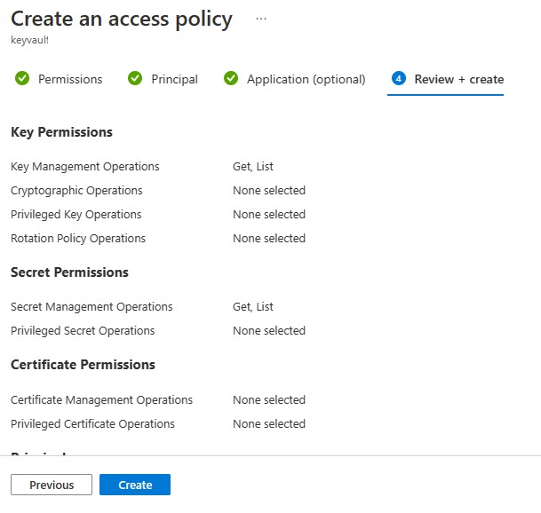
    
25.	  Go to **Secrets** under *Objects*. Click on **+Generate/Import** and fill in the following details:  
      **Name** – ``secret``  
      **Secret value** – The Client Secret Value that you had copied earlier. (Refer Step 7)
      And click create.

      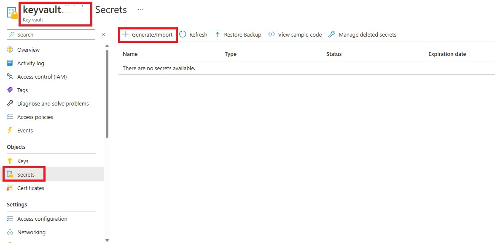
      
      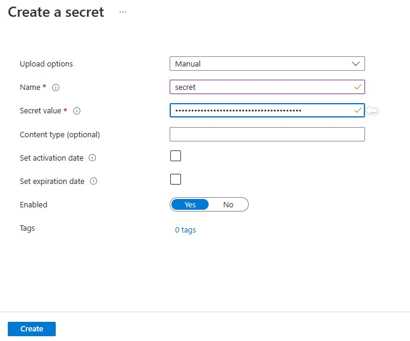
    
11.	Go to your resource group and open the **Databricks Workspace** which goes by the name {databricks-{randomstring}}.
13.	Edit the URL of the workspace as ``https://adb.......azuredatabricks.net/#secrets/createScope``.

    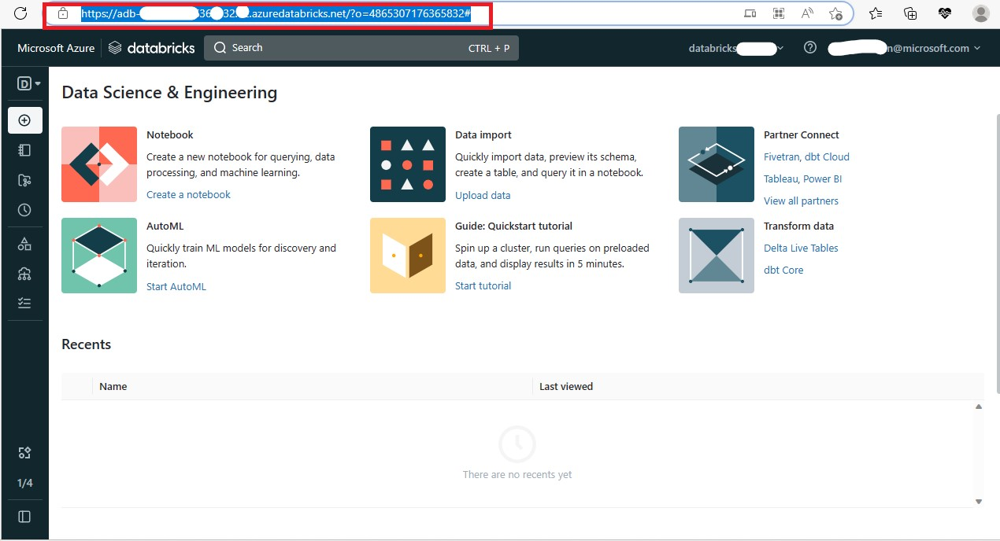
    
    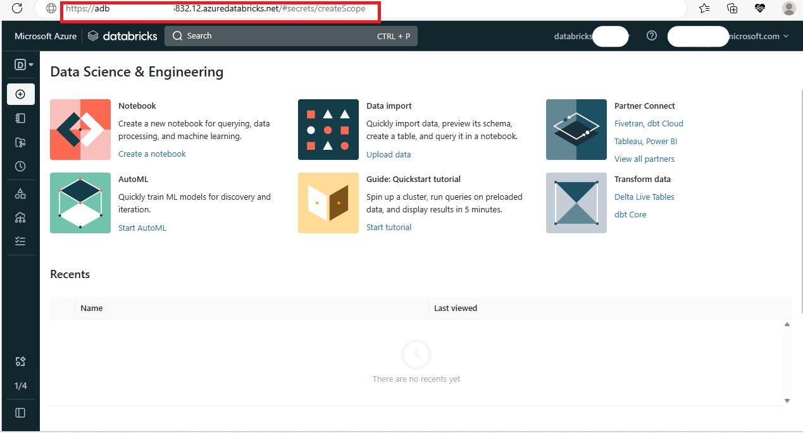
    
15.	  You should see the **Create Secret Scope** page. Fill in the following details and click on Create.  
      **Scope Name** – ``keyvaultdb``  
      **DNS Name** – Go to your resource group, **Key Vault** --> Click on **properties** under Settings --> copy the **Vault URI** and paste it.  
      **Resource** -  Go to your resource group, **Key Vault** --> Click on **properties** under Settings --> copy the **Resource ID** and paste it.  

      
      
      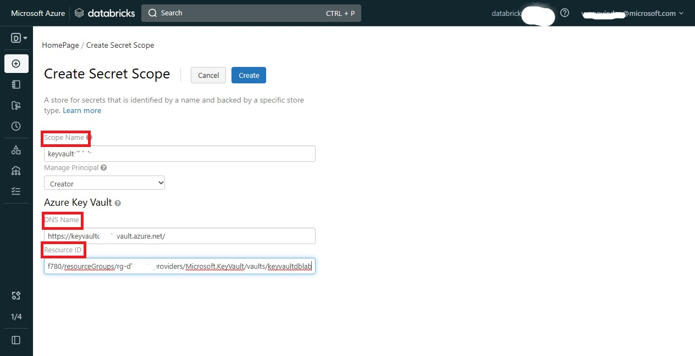
      
      Click **Ok** in the below pop-up.
      
      
  
